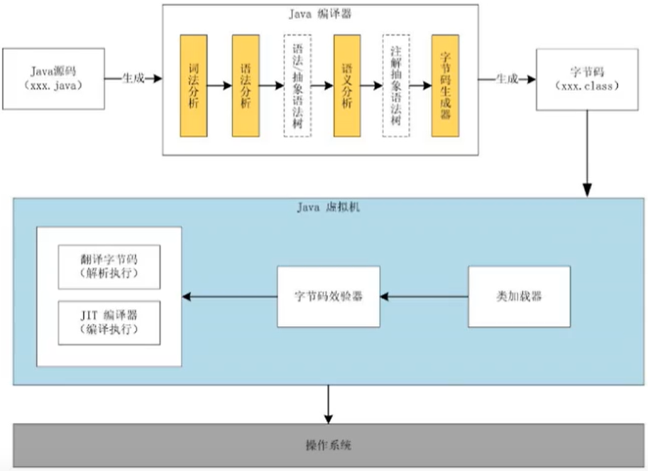
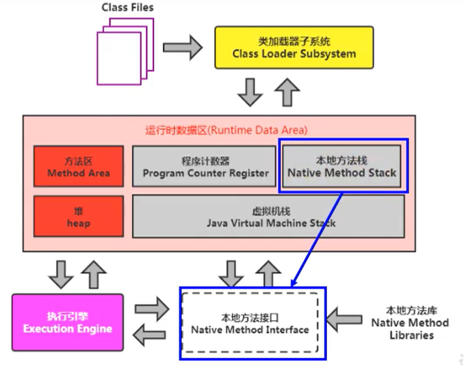
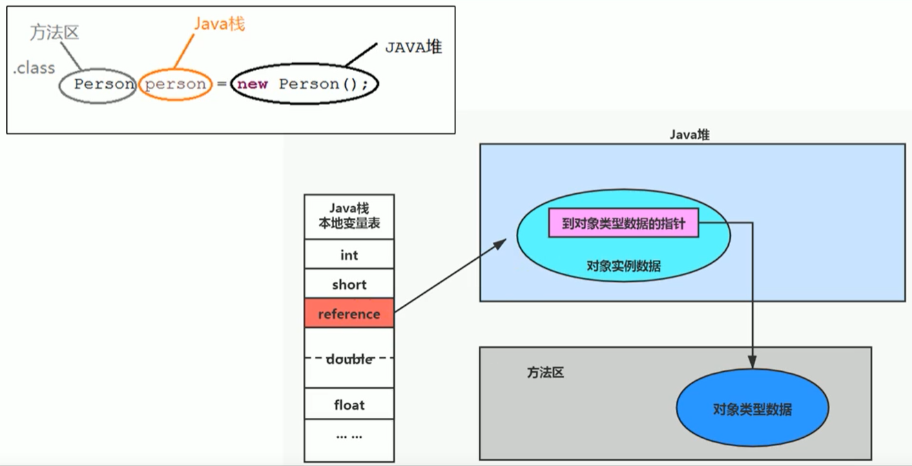

# JVM

## JVM 杂谈

> Java 是跨平台的语言，JVM 是跨语言的平台

JVM 就是二进制字节码的运行环境，负责转载字节码到其内部，解释/编译为对应平台上的机器指令执行。现在 JVM 不仅仅只是支持Java语言了，也支持其他多种语言，如 Kotlin、Groovy、Scala、Jython 等等。只要该编程语言能用编译器将代码编译成 JVM 字节码（Java 字节码），就能在 JVM 上运行

### JVM 的位置

> JVM 是程序虚拟机，模拟程序运行所需要的环境。对应的是系统虚拟机，模拟硬件环境

JVM 是运行在操作系统之上的，它与硬件没有直接的交互


### JVM 的整体结构


### Java 代码执行流程

> 执行一个所谓的 Java 程序的时候，真正在执行的是一个叫做 Java 虚拟机的进程

有两次编译：

* 第一次编译：Java 编译器（前端编译器）将 Java 源码编译成字节码文件
* 第二次编译：对于需要反复执行的热点代码，JIT 编译器（后端编译器）会将它们直接翻译成机器指令缓存起来，可供直接调用，提升性能



### JVM 的架构模型

Java 编译器输入的指令流基本上是一种基于栈的指令集架构（每执行一个方法就入栈，栈顶是正在执行的方法，执行完之后就出栈，设计和实现比较简单），另外一种指令集架构则是基于寄存器的指令集架构（x86 的二进制指令集、Android 5 之前的 Davlik 虚拟机）。Hotspot 虚拟器除了 PC 寄存器（程序计数寄存器）之外，没有包含其他寄存器了

基于栈的指令集架构的特点：

* 设计和实现更简单，适用于资源受限的系统
* 避开了寄存器的分配难题：使用零地址指令方式分配（零地址指令、一地址指令、二地址指令、三地址指令（计组））
* 不需要硬件支持，可移植性更好，更好实现跨平台（基于寄存器的指令集架构与硬件的耦合度高，不同平台的 CPU 架构不同，跨平台性差）
* 指令集小，但是对于同一个操作要执行的指令的数量比基于寄存器的指令集架构的多


## 类加载器子系统

> 加载阶段 -> 链接阶段 -> 初始化 <a name="1">[1]</a>

* 类加载器子系统负责从文件系统或网络中加载 class 文件，class 文件在文件开头有特定的文件标识
* ClassLoader 只负责 class 文件的加载，至于它是否可以运行，则由 Execution Engine（执行引擎）决定
* 加载的类信息存放于一块称为方法区的内存空间。除了类的信息外，方法区中还会存放运行时常量池信息，可能还包括字符串字面量和数字常量（这部分常量信息是 class 文件中常量池部分的内存映射）

class 文件加载到 JVM 中，被称为 DNA 元数据模板，放在方法区，根据这个文件可以实例化出 n 个一模一样的实例。ClassLoader 就相当于一个运输工具，将 class 文件从磁盘中加载到内存中（以二进制流的形式）

### 加载阶段

> 这里讲的是狭义的加载阶段，是广义的加载阶段（加载、链接、初始化）的第一个环节

* 通过一个类的全限定名获取定义此类的二进制字节流
* 将这个字节流所代表的静态存储结构转化为方法区的运行时数据结构
* 在内存中生成一个代表这个类的 `java.lang.Class` 对象，作为方法区这个类的各种数据的访问入口

### 链接阶段

> 验证（Verify） -> 准备（Prepare） -> 解析（Resolve）

#### 验证

* 目的在于确保class文件的字节流中包含信息符合当前虚拟机要求，保证被加载类的正确性，不会危害虚拟机自身安全
* 主要包括四种验证，文件格式验证（cafebabe），元数据验证，字节码验证，符号引用验证 

#### 准备

* 为==类变量==分配内存并且设置该类变量的默认初始值，即零值

  ```java
  public class PrepareTest {
      private static int a = 2;
      
      public static void main(String[] args) {
          System.out.println(a);
      }
  }
  
  // 对于这个类，在准备阶段，a被赋值0；在初始化阶段，a才被赋值2
  ```

* 这里不包含用 final 修饰的 static 变量，被 final 修饰的已经是常量而不是变量了，在编译的时候就会被分配值了，准备阶段会被显示初始化

* 不会为实例变量分配初始化，类变量会分配在方法区中，而实例变量是会随着对象一起分配到 Java 堆中（准备阶段还没有创建对象，只是类的加载）

 #### 解析

* 将常量池内的符号引用转换为直接引用的过程
  
* 符号引用就是一组符号来描述所引用的目标。符号引用的字面量形式明确定义在《Java 虚拟机规范》的 class 文件格式中。直接引用就是直接指向目标的指针、相对偏移量或一个间接定位到目标的句柄
* 事实上，解析操作往往会伴随着 JVM 在执行完初始化之后再执行
* 解析动作主要针对类或接口、字段、类方法、接口方法、方法类型等。对应常量池中的 CONSTANT_Class_info、CONSTANT_Fieldref_info、CONSTANT_Methodref_info 等

### 初始化

> 初始化阶段就是执行类构造器方法 `<clinit>()` 的过程

* `<clinit>()` 方法不需要我们定义，是 javac 编译器自动收集类中的所有类变量的赋值动作和静态代码块中的语句合并而来。如果没有类变量和静态代码块，也就没有`<clinit>()` 方法
  对于下面这个类：

  ```java
  public class Initialization {
  
      private static int num = 1;
  
      static {
          num = 6;
      }
  
      public static void main(String[] args) {
          System.out.println(Initialization.num);
      }
  }
  ```

  编译此类，然后用 Jclasslib 查看它的 class 文件，可以看到如下信息:
  

* 构造器方法中指令按语句在源文件中出现的顺序执行

* `<clinit>()` 不同于类的构造器（构造器是虚拟机视角下的 `<init>()` 方法）

* ❗ 若该类具有父类，JVM 会保证子类的 `<clinit>()` 方法执行之前，父类的 `<clinit>()` 方法已经执行完毕

* ❗ 虚拟机必须保证一个类的 `<clinit>()` 方法在多线程下被同步加锁，==保证一个类只会被加载一次== <a name="2">[2]</a>

**一个小重点**：
对于下面这段代码

```java
public class Initialization {

    private static int num = 1;

    static {
        num = 6;
        notice = 20;
    }

    private static int notice = 10;

    public static void main(String[] args) {
        System.out.println(Initialization.num);
        System.out.println(notice);
    }
}
```

它的输出如下

```
6
10
```

注意注意，不是输出6、20，而是输出6、10

解释如下：
①先在静态代码块中对 `notice` 赋值20，然后再声明 `notice` 为10，这样的顺序看起来很怪，但是它是被允许的。因为在链接阶段的准备时期，已经为 `notice` 分配内存并赋值为0了，所以在初始化阶段执行到静态代码块时，`notice` 已经被声明了
②那，为什么输出的 `notice` 的值是10，而不是20呢？因为在初始化阶段执行 `<clinit>` 方法时是按照源代码中的语句顺序进行执行的，所以是 `notice` 的值由0变成20，再由20变成10，如下图所示：


但是但是，如果想要在静态代码块中打印 `notice` 的值时，会报错：非法的前向引用，因为 `notice` 是在后面声明的


## 类加载器

> JVM支持两种类型的类加载器：引导类加载器（Bootstrap ClassLoader）和自定义类加载器（User-Defined ClassLoader）

* 所有派生于抽象类 `ClassLoader` 的类加载器都划分为自定义类加载器。`ClassLoader` 类是一个抽象类，除了引导类加载器，其后所有的类加载器都继承自 `ClassLoader`
* 不论类加载器的类型如何划分，在程序中我们最常见的类加载器始终只有3个：Bootstrap ClassLoader、Extension ClassLoader、System ClassLoader
  

* Java 的 Bootstrap ClassLoader 是由 C++ 编写的，负责加载JDK中的核心类库。这样设计的原因是涉及到一个类似操作系统中”鸡生蛋，蛋生鸡“的问题，因为所有的类都是通过ClassLoader装载，可是ClassLoader本身也是一个类，那第一个ClassLoader由谁来负责装载？实际上这部分工作就是由Bootstrap ClassLoader来完成的，类似于操作系统启动时的boot loader

  ```java
  public static void main(String[] args) {
      ClassLoader systemClassLoader = ClassLoader.getSystemClassLoader();
      // 获取系统类加载器
      System.out.println(systemClassLoader);
  
      ClassLoader extClassLoader = systemClassLoader.getParent();
      // 获取其上层：扩展类加载器
      System.out.println(extClassLoader);
  
      // 获取其上层：获取不到引导类加载器
      System.out.println(extClassLoader.getParent());
  }
  
  ----- 输出如下 -----
  sun.misc.Launcher$AppClassLoader@18b4aac2
  sun.misc.Launcher$ExtClassLoader@677327b6
  null
  ```

* ```java
  public class ClassLoaderTest {
  
      public static void main(String[] args) {
          ClassLoader classLoader = ClassLoaderTest.class.getClassLoader();
          // 对于用户自定义类来说：默认使用系统类加载器进行加载
          System.out.println(classLoader);
  
          ClassLoader stringClassLoader = String.class.getClassLoader();
          // 对于系统的核心类库来说：使用引导类加载器进行加载
          System.out.println(stringClassLoader);
      }
  }
  
  ----- 输出如下 -----
  sun.misc.Launcher$AppClassLoader@18b4aac2
  null
  ```

### 引导类加载器

> 又名启动类加载器，Bootstrap ClassLoader

* 这个类加载器是由 C/C++ 语言实现的，嵌套在 JVM 内部（可以说是 JVM 的一部分）

* 它用来加载 Java 的核心类库（ JAVA_HOME/jre/lib/rt.jar 、resources.jar 或 sun.boot.class.path 路径下的内容），用于提供 JVM 自身需要的类

* 它不继承自 `java.lang.ClassLoader` ，没有父加载器

* 加载扩展类加载器和应用程序类加载器，并指定为他们的父类加载器

* 出于安全考虑，Bootstrap 启动类加载器只加载包名为 java、javax、sun 等开头的类

* 查看引导类加载器加载的路径：

  ```java
  public static void main(String[] args) {
      URL[] urLs = Launcher.getBootstrapClassPath().getURLs();
      for (URL url : urLs) {
          System.out.println(url.toExternalForm());
      }
  }
  ```

### 扩展类加载器

> ExtClassLoader

* 由 Java 语言编写，由 `sum.misc.Launcher$ExtClassLoader` 实现

* 派生于 `ClassLoader` 类

* 父类加载器为启动类加载器

* 从 java.ext.dirs 系统属性所指定的目录中加载类库，或从 JDK 的安装目录的 jre/lib/ext 子目录（扩展目录）下加载类库。如果用户创建的 JAR 放在此目录下，也会自动由扩展类加载器加载

* 查看扩展类加载器加载的路径：

  ```java
  public static void main(String[] args) {
      String property = System.getProperty("java.ext.dirs");
      for (String path : property.split(";")) {
          System.out.println(path);
      }
  }
  ```

### 系统类加载器

> 又名应用程序类加载器，AppClassLoader

* 由 Java 语言编写，由 `sun.misc.Launcher$AppClassLoader` 实现。`sun.misc.Launcher` 是 Java 虚拟机的入口应用，因为 `ExtClassLoader` 和 `AppClassLoader` 都是 `Launcher` 的内部类
* 派生于 `ClassLoader` 类
* 父类加载器为扩展类加载器
* 它负责加载环境变量 classpath 或系统属性 java.class.path 指定路径下的类库
* 该类加载器==是程序中默认的类加载器==，一般来说，Java 应用的类都是由它来完成加载的
* 通过 `ClassLoader#getSystemClassLoader()` 方法可以获取到该类加载器

### 用户自定义类加载器

为什么要自定义类加载器？

* 隔离加载类。当类发生冲突时，例如多个类的包名和类名一样时
* 修改类加载的方式
* 扩展加载源
* 防止源码泄露

### 获取 ClassLoader

* 方式一：获取当前类的 `ClassLoader`

  ```java
  clazz.getClassLoader()
  ```

* 方式二：获取当前线程上下文的 `ClassLoader`

  ```java
  Thread.currentThread().getContextClassLoader()
  ```

* 方式三：获取系统的 `ClassLoader`

  ```java
  ClassLoader.getSystemClassLoader()
  ```

* 方式四：获取调用者的 `ClassLoader`

  ```java
  DriverManager.getCallerClassLoader()
  ```

### 双亲委派机制

> Java 虚拟机对 class 文件采用的是按需加载的方式，也就是说当需要使用该类时才会将它的 class 文件加载到内存生成 class 对象
>
> 加载某个类的 class 文件时，Java 虚拟机采用的是双亲委派模式，即把请求交由父类处理，它是一种任务委派模式

工作原理：

* 如果一个类加载器收到了类加载请求，它并不会自己先去加载，而是把这个请求委托给父类的加载器去执行
* 如果父类加载器还存在父类加载器，则进一步向上委托，依次递归，请求最终将会到达顶层的启动类加载器
* 如果父类加载器可以完成类加载任务，就成功返回，倘若父类加载器无法完成此加载任务，子加载器才会尝试自己去加载，这就是双亲委派模式

一个例子：
在项目中新建了一个 `java.lang` 包并在其中自定义了一个名为 `String` 的类，当你在此项目中使用了 `String` 时，例如：`java.lang.String str = new java.lang.String()` ，当程序运行加载时，`str` 的类型被加载为核心类库中的 `String` 类（由Bootstrap ClassLoader加载），而不是你自定义的 `String` 类（由 AppClassLoader 加载），这就是双亲委派模式


同样地，看下面的代码：

```java
package java.lang;

/**
 * 自定义的String类
 *
 * @author spice
 * @date 2021/07/15 1:45
 */
public class String {

    static {
        System.out.println("自定义的String类");
    }

    public static void main(String[] args) {
        System.out.println("自定义的String类执行了");
    }
}

----- 运行结果 -----
错误: 在类 java.lang.String 中找不到 main 方法, 请将 main 方法定义为:
   public static void main(String[] args)
否则 JavaFX 应用程序类必须扩展javafx.application.Application
```

因为加载了核心类库中的 `String` 类，但是它并没有 `main` 方法

双亲委派机制的好处：

* 避免类的重复加载
* 保护程序安全，防止核心 API 被随意篡改（沙箱安全机制）

所以，在 JVM 中判断两个 class 对象是否为同一个类存在两个必要条件 <a name="3">[3]</a>：

* 类的完整类名必须一致（全限定类名）
* 加载这个类的 ClassLoader（指 ClassLoader 实例对象）必须相同

JVM 必须知道一个类型是由启动类加载器加载的还是由用户类加载器加载的。如果一个类型是由用户类加载器加载的，那么 JVM 会将这个类加载器的一个引用作为类型信息的一部分保存在方法区中。当解析一个类型到另一个类型的引用的时候，JVM 需要保证这个两个类型的类加载器是相同的

Java 程序对类的使用方式分为主动使用和被动使用。其中主动使用又分为七种情况：

* 创建类的实例
* 访问某个类或接口的静态变量，或者对该静态变量赋值
* 调用类的静态方法
* 反射（比如 `Class.forName("com.spice.Application")`）
* 初始化一个类的子类
* Java 虚拟机启动时被标明为启动类的类
* JDK 7 开始提供的动态语言支持：`java.lang.invoke.MethodHandle` 实例的解析结果，REF_getStatic、REF_putStatic、REF_invokeStatic句柄对应的类没有初始化时则进行初始化

除了以上七种情况，其他使用 Java 类的方式都被看作是对类的被动使用，都不会导致类的初始化


## 运行时数据区

> JVM 内存布局规定了 Java 在运行过程中内存申请、分配、管理的策略，保证了 JVM 的高效稳定运行
>
> 不同的 JVM 对于内存的划分方式和管理机制存在着部分差异（经典差异：有无方法区）
>
> 一个 JVM 对应一个唯一的 Runtime 实例，一个 Runtime 实例可以看成是一份运行时数据区（运行时环境）

经典的 JVM 内存布局（Hotspot）：


更细致的布局：


注意，在 JDK 8 以前，元数据区叫做永久代，从 JDK 8 开始才改名为元数据区

元数据区和 JIT 编译产物可称为非堆空间

**对应进程和对应线程**

Java 虚拟机定义了若干种程序运行期间会使用到的运行时数据区，其中有一些会随着虚拟机启动而创建，随着虚拟机退出而销毁（对应进程，一个虚拟机对应一个进程）。另外一些则是与线程对应，这些与线程对应的数据区域会随着线程开始和结束而创建和销毁。分别如下：

* 和线程对应（线程独占）：程序计数器、本地方法栈、虚拟机栈
* 和进程对应（线程间共享）：方法区、堆、堆外内存（永久代或元空间、代码缓存）

从线程共享与否的角度来看运行时数据区的结构：


## 线程

线程是一个程序里的运行单元，JVM 允许一个应用有多个线程并行的执行

在 Hotspot JVM 里，每个线程都与操作系统的本地线程直接映射。当一个 Java 线程准备好执行以后，此时一个操作系统的本地线程也同时创建。Java 线程执行终止后，本地线程也会回收

操作系统负责所有线程的安排调度到任何一个可用的 CPU 上。一旦本地线程初始化成功，它就会调用 Java 线程中的 `run()` 方法。如果 Java 线程在执行过程中异常终止（例如抛出了一个未捕获的异常），则由本地线程来决定 JVM 是否终止（如果只剩下守护线程，则终止）

主要的后台系统线程：

* 虚拟机线程
* 周期任务线程
* GC 线程
* 编译线程
* 信号调度线程


## 程序计数器

> 也称作 PC 寄存器（Program Counter Register）

* JVM 的程序计数器是对物理 PC 寄存器的一种抽象模拟（属于软件层面的），用来存储指向下一条指令的地址（即将要执行的代码），由执行引擎读取下一条指令

* 它是一块很小的内存空间（几乎可以忽略不计），也是运行速度最快的存储区域

* 在 JVM 规范中，每个线程都有自己的程序计数器，==是线程私有的==，生命周期与线程的生命周期一致

* 任何时间一个线程都只有一个方法在执行，也就是所谓的当前方法。程序计数器会存储当前线程正在执行的 Java 方法的 JVM 指令地址；或者，如果是在执行 native 方法，则是未指定值（undefined）
* 它是程序控制流的指示器（行号指示器），分支、循环、跳转、异常处理、线程恢复等基础功能都需要依赖这个计数器来完成
* 字节码解释器工作时就是通过改变这个计数器的值来选取下一条需要执行的字节码指令
* ==它是唯一 一个在 Java 虚拟机规范中没有规定任何 OutOfMemoryError 情况的区域（没有 OOM ）==
* ==没有 GC==

:question: 问：使用 PC 寄存器存储字节码指令地址有什么用呢？（为什么使用 PC 寄存器记录当前线程的执行地址呢？）

💡 答：因为 CPU 需要不停地切换各个线程，这时候切换回来以后，就得知道接着从哪开始继续执行。JVM 的字节码解释器就需要通过改变 PC 寄存器的值来明确下一条应该执行什么样的	字节码指令

:question: 问：PC 寄存器为什么被设置成线程私有的？

:bulb: 答：为了能够准确地记录各个线程正在执行的当前字节码指令地址，最好的办法自然是为每一个线程都分配一个 PC 寄存器


## 虚拟机栈

> 早期也叫 Java 栈（Java Virtual Machine Stack）

**介绍：**

* 由于跨平台性的设计，Java 的指令都是根据栈来设计的。不同平台 CPU 架构不同，所以不能设计为基于寄存器的 
* 如果将 JVM 中的内存结构非常粗粒度地理解为只有堆（heap）和栈（stack），那么堆是存储的单位（数据怎么放、放在哪儿），而栈则是运行时的单位（程序如何执行、如何处理数据）
* 每个线程在创建时都会创建一个虚拟机栈（==是线程私有的==，生命周期与线程的生命周期一致），其内部保存一个个的栈帧（Stack Frame），一个栈帧就对应着一个 Java 方法，处于栈顶的栈帧就表示当前方法
* 主管 Java 程序的运行，它保存方法的局部变量（8中基本数据类型、引用类型变量的==引用地址==（引用类型变量真正存放在堆中））、部分结果，并参与方法的调用和返回
* 栈是一种快速有效的分配存储方式，访问速度仅次于程序计数器
* JVM 直接堆 Java 虚拟机栈的操作只有两个：①每个方法执行，伴随着进栈（入栈、压栈）；②执行结束后的出栈工作
* 在一条活动线程中，一个时间点上，只会有一个活动的栈帧，即只有当前正在执行的方法的栈帧（栈顶栈帧）是有效的，这个栈帧被称为当前栈帧（Current Frame）
* 执行引擎运行的所有字节码指令只针对当前栈帧进行操作
* 不同线程中所包含的栈帧是不允许存在相互引用的，即不可能在一个栈帧之中引用另外一个线程的栈帧（Java 虚拟机栈是线程私有的）
* Java 的两种函数返回方式（正常 reture 和抛出未捕获的异常）都会导致栈帧被弹出
* ==没有 GC，对栈来说不存在垃圾回收问题==（所以本地方法栈也没有 GC ）
* ==存在 OOM==

**栈中可能出现的异常：**

Java 虚拟机规范允许 Java 栈的大小是动态的或者固定不变的

* 如果采用固定大小的 Java 虚拟机栈，那每一个线程的 Java 虚拟机栈容量可以在线程创建的时候独立选定。如果线程请求分配的栈容量超过 Java 虚拟机栈允许的最大容量，Java 虚拟机将会抛出一个 `StackOverflowError` 异常（==栈空间不足==）
* 如果 Java 虚拟机栈可以动态扩展，并且在尝试扩展的时候无法申请到足够的内存，或者在创建新的线程时没有足够的内存去创建对应的虚拟机栈，那么 Java 虚拟机将会抛出一个 `OutOfMemoryError` 异常（==内存空间不足==）

**设置栈内存大小：**

可以使用参数 -Xss 选项来设置线程的最大栈空间（官方文档 -> [传送门](https://docs.oracle.com/en/java/javase/11/tools/java.html#GUID-3B1CE181-CD30-4178-9602-230B800D4FAE)），栈的大小直接决定了函数调用的最大可达深度

### 栈帧

每个栈帧中存储着：

* 局部变量表（Local Variables）（局部变量表是与性能调优关系最为密切的部分，==局部变量表中的变量也是重要的垃圾回收根节点，只要被局部变量表中直接或间接引用的对象都不会被回收==）
* 操作数栈（Operand Stack）（或者称为表达式栈）
* 动态链接（Dynamic Linking）（或称为指向运行时常量池的方法引用）
* 方法返回地址（Return Address）（或称为方法正常退出或者异常退出的定义）
* 一些附加信息

#### 局部变量表

> 也被称之为局部变量数组或本地变量表

* 定义为一个数字数组，主要用于存储方法参数和定义在方法体内的局部变量，这些数据类型包括8种基本数据类型、对象引用（reference）、以及returnAddress类型。参数值的存放总是在局部变量数组的 index0 开始，到数组长度-1的索引结束

* 由于局部变量表是建立在线程的栈上，是线程的私有数据，因此不存在数据安全问题（多线程不安全问题）

* 局部变量表所需的容量大小是在编译器确定下来的，并保存在方法的 Code 属性的 maximum local variables 数据项中，在方法运行期间不会改变其大小

* 方法嵌套调用的次数由栈的大小决定。一般来说，栈越大，方法嵌套调用次数越多。对一个函数而言，它的参数和局部变量越多，使得局部变量表膨胀，它的栈帧就越大，以满足方法调用所需传递的信息增大的需求，进而函数调用就会占用更多的栈空间，导致其嵌套调用次数就会减少

* 局部变量表中的变量只在当前方法调用中有效

* 最基本的存储单元是 Slot（变量槽）。在局部变量表里，32位以内的类型只占用一个 Slot（包括 returnAddress 类型），64位的类型（long 和 double）占用两个 Slot

  * byte、short、char 在存储前被转换为 int，boolean 也被转换为 int，0表示 false，非0表示 true

* 按照源代码中的声明顺序存储数据

* 如果当前帧是由构造方法或者实例方法（非静态方法）创建的，那么该对象引用 this 将会存放在 index 为0的 slot 处，其余的参数按照参数表顺序继续排列。例如：

  ```java
  public void methodTwo() {
      long j = 4;
      LocalDateTime now = LocalDateTime.now();
      System.out.println(j);
  }
  
  ----- 此方法的LocalVariableTable如下（局部变量最大槽数为4） -----
  Nr.		起始PC	长度		序号		名字		描述符
  0		0		  16		0		this	  Lcom/spice/LocalVariablesTest;
  1		4		  12		1		j		  J
  2		8		  8			3		now		  Ljava/time/LocalDateTime;
  注: 
  ①在描述符中，前面有"L"表示这是一个对象引用
  ②j是long类型的，要占用两个slot，所以序号1和2都是属于j
  ```

* 栈帧中的局部变量表中的槽位是可以重用的，如果一个局部变量过了其作用域，那么在其作用域之后申明的新的局部变量就很有可能会复用过期局部变量的槽位，从而达到节省资源的目的。例如：

  ```java
  public void methodThree() {
      int a = 2;
      {
          int b = 5;
      }
      int c = 9;
  }
  
  ----- 此方法的LocalVariableTable如下（局部变量最大槽数为3） -----
  Nr.		起始PC	长度		序号		名字		描述符
  0		0		  8			0		this	  Lcom/spice/LocalVariablesTest;
  1		2		  6			1		a	  	  I
  2		7		  1			2		c	  	  I
  注：
  ①在局部变量表中没有看到b，是因为c复用了b的槽位（在声明c时b的作用域已经过了）
  ②还可以看到局部变量的最大槽数是3而不是4
  ```

变量的分类：

* 按照数据类型分：①基本数据类型；②引用数据类型
* 按照在类中声明的位置分：
  * ①成员变量：在使用前，都经历过默认初始化赋值
    * I. 类变量：链接阶段的准备时期会给类变量默认赋值，在初始化阶段会给类变量显示赋值
    * II.实例变量：随着对象的创建，会在堆空间中分配实例变量空间，并进行默认赋值
  * ②局部变量：在使用前必须要进行显示赋值，否则编译不通过

#### 操作数栈

> 也称之为表达式栈（Operand Stack）

* 用数组实现的

* 在方法执行过程中，根据字节码指令，往栈中写入数据或提取数据，即入栈（push）/ 出栈（pop）

* Java 虚拟机的解释引擎是基于栈的执行引擎，其中的栈指的就是操作数栈

* 主要用于保存计算过程的中间结果，同时作为计算过程中变量临时的存储空间

* 操作数栈就是 JVM 执行引擎的一个工作区，当一个方法刚开始执行的时候，一个新的栈帧也会随之被创建出来，这个方法的操作数栈是空的

* 每一个操作数栈都会拥有一个明确的栈深度用于存储数值，其所需的最大深度在编译器就定义好了，保存在方法的 Code 属性中，为 max_stack 的值

* 栈中的任何一个元素都是可以任意的 Java 数据类型

  * 32bit 的类型占用一个栈单位深度
  * 64bit 的类型占用两个栈单位深度

* 操作数栈并非采用访问索引的方式来进行数据访问的，而是只能通过标准的入栈和出栈操作来完成一次数据访问

* 如果被调用的方法带有返回值的话，其返回值将会被压入当前栈帧的操作数栈中，并更新 PC 寄存器中下一条需要执行的字节码指令。例如：

  ```java
  public void methodFive() {
      // 调用了本类中方法methodFour()
      int i = methodFour();
      int k = 10;
  }
  
  ----- 方法methodFive()的字节码如下 -----
  0 aload_0
  1 invokevirtual #7 <com/spice/LocalVariablesTest.methodFour : ()I>
  4 istore_1
  5 bipush 10
  7 istore_2
  8 return
  注: 
  ①一开始就执行指令aload_0从局部变量表的index0位置加载this实例，用于方法调用
  ②然后执行指令invokeVirtual调用methodFour()方法
  ③然后执行指令istore_1将返回结果存储到局部变量表的index1位置
  ```

* 操作数栈中元素的数据类型必须与字节码指令的序列严格匹配，这由编译器在编译期间进行验证，同时在类加载过程中的类检验阶段的数据流分析阶段要再次验证

以下面的程序和对应的图来解释操作数栈的出栈和入栈过程以及和局部变量表、PC 寄存器的联动：

```java
public void operandStackTest() {
    byte i = 15;
    int j = 8;
    int k = i + j;
}
```


① 方法 operandStackTest 一开始被调用时，操作数栈为空，局部变量表的 index0 位置为 this（非静态方法），PC 寄存器指向下一条要执行的指令（0: bipush 15）
② 执行 PC 寄存器指向的指令 0: bipush 15，表示将一个 byte 类型的数据15压入操作数栈中，此时操作数栈有数据15，PC 寄存器指向下一条要执行的指令（2: istore_1）
③ 执行 PC 寄存器指向的指令 2: istore_1，表示从操作数栈弹出栈顶数据作为 int 型数据存入局部变量表的 index1 位置（因为是“_1”），此时局部变量表的 index1 位置为15，PC 寄存  器指向下一条要执行的指令（3: bipush 8）。注意：前面说过 byte、short、char、boolean 类型的数据都以 int 类型来保存
④ 依次规律继续执行完余下的指令

*栈顶缓存技术（ToS，Top-of-Stack Cashing）：*

由于操作数是存储在内存中的，因此频繁地执行内存读/写操作必然会影响执行速度（况且基于栈式架构的虚拟机完成一项操作需要更多的指令分派）。为了解决这一问题，设计出了栈顶缓存技术：将栈顶元素全部缓存在物理 CPU 的寄存器中，以此降低对内存的读/写次数，提升执行引擎的执行效率

#### 动态链接

> Dynamic Linking

* 每一个栈帧内部都包含一个指向==运行时常量池==中该栈帧所属方法的引用。包含这个引用的目的就是为了支持当前方法的代码能够实现动态链接，比如 invokedynamic 指令
* 在 Java 源文件被编译到字节码文件中时，所有的变量和方法引用都作为符号引用（Symbolic Reference）保存在 class 文件的常量池里。比如：描述一个方法调用了另外的其他方法时，就是通过常量池中指向方法的符号引用来表示的。所以动态链接的作用就是为了将这些符号引用转换为调用方法的直接引用

在 JVM 中，将符号引用转换为调用方法的直接引用与方法的绑定机制相关（绑定是一个字段、方法或者类在符号引用被替换为直接引用的过程，这仅仅发生一次）

静态链接和动态链接的区别：

* 静态链接：当一个字节码文件被装载进 JVM 内部时，如果被调用的目标方法在编译期可知，且运行期保持不变时，这种情况下将调用方法的符号引用转换为直接引用的过程称之为静态链接，对应早期绑定（Early Binding）机制。面向过程的语言只有早期绑定

* 动态链接：如果被调用的方法在编译期无法被确定下来，只能够在程序运行期将调用方法的符号引用转换为直接引用，这种引用转换过程具备动态性，因此也被称之为动态链接，对应晚期绑定（Late Binding）机制（==多态性==）

* 示例：

  ```java
  abstract class Animal {
  
      public abstract void eat();
  }
  
  class Cat extends Animal {
  
      public Cat() {
          // 早期绑定
          super();
      }
  
      public Cat(String name) {
          // 早期绑定
          this();
      }
  
      @Override
      public void eat() {
          System.out.println("fish");
      }
  }
  
  class Dog extends Animal {
  
      @Override
      public void eat() {
          System.out.println("bone");
      }
  }
  
  public class Test {
      
      public void animalTest(Animal animal) {
          // 晚期绑定（d）
          animal.eat();
      }
  }
  ```

虚方法和非虚方法：

* 非虚方法：如果方法在编译期就确定了具体的调用版本，这个版本在运行时是不可变的，这样的方法就称为非虚方法。以下几种方法都是非虚方法（都不能被重写）：
  * 静态方法
  * 私有方法
  * final方法
  * 实例构造器
  * 父类方法（可被重写）
* 虚方法：其他方法称为虚方法

虚拟机中提供了以下几条方法调用指令：

* 普通调用指令（固化在虚拟机内部，方法的调用执行不可人为干预）：
  * invokestatic：调用静态方法，解析阶段确定唯一方法版本（被调用的方法是非虚方法）
  * invokespecial：调用 `<init>` 方法、私有及父类方法（显式地调用），解析阶段确定唯一方法版本（被调用的方法是非虚方法）
  * invokevirtual：调用所有虚方法（除了被 final 修饰的之外，例如隐式地（不加 `super.` ）调用父类的 final 方法时，用的是 invokevirtual，但是这个 final 方法是非虚方法）
  * invokeinterface：调用接口方法
* 动态调用指令（支持由用户确定方法版本）：
  * invokedynamic：动态解析出需要调用的方法，然后执行（Java 7 新增的指令，用于实现动态类型语言，Java 8 新增的 lambda 表达式可以直接生成 invokedynamic 指令）

动态类型语言和静态类型语言：
两者的区别就在于对类型的检查是在编译期还是在运行期，满足前者就是静态类型语言，反之就是动态类型语言
再直白一点就是：静态类型语言是判断变量自身的类型信息；动态类型语言是判断变量值的类型信息，变量没有类型信息，变量值才有类型信息，这是动态语言的一个重要特征
像 JS 就是动态类型语言，`var name = "pw"; var name = 10`，`name` 是没有类型信息的，`"pw"` 和 `10` 才有类型信息

Java 语言中方法重写的本质：
① 找到操作数栈顶的第一个元素所执行的对象的实际类型，记作 T
② 如果在类型 T 中找到与常量中的描述符合简单名称都相符的方法，则进行访问权限校验，如果通过则返回这个方法的直接引用，查找过程结束；如果不通过，则返回 `java.lang.IllegalAccessError` 异常
③ 否则，按照继承关系==从下往上==依次对 T 的各个父类进行 ② 的搜索和验证过程
④ 如果始终没有找到合适的方法，则抛出 `java.lang.AbstractMethodError` 异常

在面向对象的编程中，会很频繁地使用到动态分派，如果在每次动态分派的过程中都要重新在类的方法元数据中搜索合适的目标的话就可能影响到执行效率。因此，为了提高性能，JVM 采用在类的方法区建立一个虚方法表（virtual method table）（非虚方法不会出现在表中）来实现。使用索引表来代替查找。==每个类中都有一个虚方法表，表中存放着各个方法的实际入口==。虚方法表会在类加载的链接阶段被创建并开始初始化，类的变量初始值准备完成之后，JVM 会把该类的虚方法表也初始化完毕

#### 方法返回地址

> return address

* 存放调用该方法的 PC 寄存器的值

* 方法正常退出时，调用者的 PC 寄存器的值作为返回地址，即调用该方法的指令的下一条指令的地址
* 方法异常退出时，返回地址是要通过异常表来确定，栈帧中一般不会保存这部分信息。正常完成出口和异常完成出口的区别在于：通过异常完成出口退出的不会给他的上层调用者产生任何的返回值

本质上，方法的退出就是当前栈帧出栈的过程。此时，需要恢复上层方法的局部变量表、操作数栈、将返回值压入调用者栈帧的操作数栈、设置 PC 寄存器值等，让调用者方法继续执行下去

在字节码指令中，返回指令包含 ireturn（当返回值是 boolean、byte、char、short 和 int 类型时使用）、lreturn、freturn、dreturn 以及 areturn（用于引用类型），另外还有一个 return 指令供声明为 void 的方法、实例初始化方法、==静态代码块==、类和接口的初始化方法使用

#### 一些附加信息

栈帧中还允许携带与 Java 虚拟机实现相关的一些附加信息。例如，对程序调试提供支持的信息


## 本地方法

> Native Method

简单地讲，一个 Native Method 就是一个 Java 调用非 Java 代码的接口
在定义一个 native method 时，并不提供实现体（有点像定义一个 Java 接口或抽象方法），因为其实现体是由非 Java 语言在外面实现的
本地接口的作用是融合不同的编程语言为 Java 所用，它的初衷是融合 C/C++ 程序

为什么要使用 Native Method ？

* 有些层次的任务用 Java 实现起来不容易，或者对程序的效率很在意时问题就出现了
* 当时 Java 刚诞生时是 C 语言横行的时期，所以要尽可能地兼容 C 语言

* 与 Java 环境外交互：==有时 Java 应用需要与 Java 外面的环境交互，这是本地方法存在的主要原因==。Java 需要与一些底层系统，如和操作系统或某些硬件交换信息。本地方法正是这样一种交流机制：它为我们提供了一个非常简洁的接口。而且我们无需去了解 Java 应用之外的繁琐的细节 
* 与操作系统交互：JVM 支持着 Java 语言本身和运行时库，它是 Java 程序赖以生存的平台，它由一个解释器（解释字节码）和一些连接到本地代码的库组成。然而不管怎样，它毕竟不是一个完整的系统，它经常依赖于一些底层系统的支持。这些底层系统常常是强大的操作系统。通过使用本地方法，我们得以用 Java 实现了 jre 的与底层系统的交互，甚至 JVM 的一些部分就是用 C 写的。还有，如果我们要使用一些 Java 语言本身没有提供封装的操作系统的特性时，我们也需要使用本地方法
* Sun’s java ：Sun 的解释器是用 C 实现的，这使得它能像一些普通的 C 一样与外部交互。jre 大部分是用 Java 实现的，它也通过一些本地方法与外界交互。例如：类 `java.lang.Thread` 的 `setPriority()` 方法是用 Java 实现的，但是它实现调用的是该类里的本地方法 `setPriority0()` 。这个本地方法是用 C 实现的，并被植入 JVM 内部，在 Windows 95 的平台上，这个本地方法最终将调用 Win32 SetPriority() API 。这是一个本地方法的具体实现由 JVM 直接提供，更多的情况是本地方法由外部的动态链接库（external dynamic link library）提供，然后被 JVM 调用


## 本地方法栈

> Native Method Stack、“C” Stack

* Java 虚拟机栈用于管理 Java 方法的调用，而本地方法栈用于管理本地方法的调用
* 线程私有的
* 允许被实现成固定或者是可动态扩展的内存大小（在内存溢出方面和虚拟机栈是相同的）
  * StackOverflowError：栈大小固定，但是栈容量不足时
  * OutOfMemoryError：内存不足导致栈容量无法扩展时
* 在本地方法栈中登记 native 方法，在 Execution Engine 执行时加载本地方法库
  
* 当某个线程调用一个本地方法时，它就进入了一个全新的并且不再受虚拟机限制的世界。它和虚拟机拥有同样的权限：
  * 本地方法可以通过本地方法接口来==访问虚拟机内部的运行时数据区==
  * 本地方法甚至可以直接使用本地处理器中的寄存器
  * 直接从本地内存的堆中分配任意数量的内存
* 并不是所有的 JVM 都支持本地方法（Hotspot 支持）


## 堆

* 一个进程对应一个 JVM 实例，一个 JVM 实例只有一个运行时数据区，一个运行时数据区只有一个堆，所以一个 JVM 实例只存在一个堆内存。堆也是 Java 内存管理的核心区域
* 被多个线程共享
* Java 堆区在 JVM 启动的时候即被创建，其空间大小也就确定了，但是堆内存的大小是可以调节的
  * -Xms：设置堆内存的初始空间
  * -Xmx：设置堆内存的最大空间
* 堆区是 JVM 管理的最大一块内存空间
* 《Java 虚拟机规范》规定：堆可以处于物理上不连续的内存空间中，但在逻辑上它应该被视为连续的
* 所有的线程共享 Java 堆，在这里还可以划分==线程私有==的缓冲区（Thread Local Allocation Buffer，TLAB）
* 《Java 虚拟机规范》中对 Java 堆的描述是：所有的对象实例以及数组都应当在运行时分配在堆上。但是，“所有”应该改成“几乎”
* 数组和对象可能永远不会存储在栈上，因为栈帧中保存引用，这个引用指向对象或数组在堆中的位置
* ==在方法结束后，堆中的对象不会马上被移除，仅仅在垃圾收集的时候才会被移除==
* 堆是 GC 执行垃圾回收的重点区域

### 内存细分

> 堆的核心

现代垃圾收集器大部分都基于分代收集理论设计，堆空间细分为：

* Java 7 及之前堆内存逻辑上分为三部分：新生区 + 养老区 + 永久区
  * Young Generation Space：新生区、Young/New、新生代、年轻代，又被划分为 Eden 区和 Survivor 区
  * Tenure Generation Space：养老区、Old/Tenure、老年区、老年代
  * Permanent Space：永久区、Perm、永久代
* Java 8 及之后堆内存逻辑上分为三部分：新生区 + 养老区 + 元空间
  * Young Generation Space：新生区、Young/New、新生代、年轻代，又被划分为 Eden 区和 Survivor 区
  * Tenure Generation Space：养老区、Old/Tenure、老年区、老年代
  * Meta Space：元空间、Meta

实际上，堆内存不包含永久代或者元空间，只是逻辑上划分到堆内存而已。当通过 -Xms 或 -Xmx 参数改变堆内存的大小时，只是改变新生代和老年代的总大小。例如，当通过设置 JVM 参数为 `-Xms20m -Xmx20m` 时，通过 `Visual GC` 插件可以看到堆内存的大小分配如下：


新生代（Eden Space、Survivor 0 和 Survivor 1）的大小加上老年代（Old Gen）的大小就等于设定的 20M 了，不包含元空间的大小

### 堆区大小

> 相关参数见 [JVM 参数 - 堆](# 堆相关)

* 在默认情况下，堆空间的大小为：

  * 初始内存大小：物理电脑内存大小 / 64

  * 最大内存大小：物理电脑内存大小 / 4

  * 使用 Java 来查看：

    ```java
    System.out.println("JVM中的堆内存总量: " + Runtime.getRuntime().totalMemory() / 1024 / 1024 + "M");
    System.out.println("JVM试图使用的最大堆内存量: " + Runtime.getRuntime().maxMemory() / 1024 / 1024 + "M");
    ```

* 一旦堆区中的内存大小超过最大大小（-Xmx）就会报 OOM

* ==在开发中建议将初始堆内存和最大堆内存设置成相同的值==，避免因为频繁地对堆内存进行扩容和缩容而造成不必要的开销

### 新生代和老年代

> YoungGen and OldGen

存储在 JVM 中的 Java 对象可以被划分为两类：

* 一类是生命周期较短的瞬时对象，这类对象的创建和消亡都非常迅速
* 另一类对象的生命周期却非常长，在某些极端的情况下还能够与 JVM 的生命周期保持一致

新生代可以划分为：

* Eden 空间：伊甸园区
* Survivor0 空间：幸存者0区（也叫做 from 区、to 区）
* Survivor1 空间：幸存者1区（也叫做 from 区、to 区）

配置新生代与老年代在堆结构中的占比：

* 默认 -XX:NewRatio=2，表示新生代占1，老年代占2，新生代占整个堆的1/3
* 可以修改成 -XX:NewRatio=4，表示新生代占1，老年代占4，新生代占整个堆的1/5（一般不会去调整这个参数，如果生命周期长的对象多，可以试着把老年代的占比调高）

另外，在 Hotspot 中，Eden 空间和另外两个 Survivor 空间缺省所占的比例是 8:1:1（但是实际上并不是 8:1:1，因为 JVM 开启了自适应内存分配策略）。可以通过参数 -XX:SurvivorRatio 来调整这个空间比例

==几乎所有==的 Java 对象都是在 Eden 区被 new 出来的；绝大部分的 Java 对象的销毁都在新生代进行（IBM 公司的专门研究表明，新生代中 80% 的对象都是”朝生夕死“的）


### 对象分配的一般过程

为新对象分配内存是一件非常严谨和复杂的任务，JVM 的设计者们不仅需要考虑内存如何分配、在哪里分配等问题，并且由于内存分配算法与内存回收算法密切相关，所以还需要考虑 GC 执行完内存回收后是否会在内存空间中产生内存碎片。具体的分配过程如下；
① new 的对象放在伊甸园区。伊甸园区有大小限制，如果伊甸园区满了，就执行 ②
② JVM 的垃圾回收器对伊甸园区进行垃圾回收（称为 YGC 或者 Minor GC）操作：
	Ⅰ. 对伊甸园区中的每个对象使用可达性算法进行判断，如果此对象没有被引用，则被视为垃圾进行销毁；
	Ⅱ. 如果此对象还被其他对象引用着，则将其放到 to 区（前面提到过 Survivor0 区和 Survivor1 区又被称为 from 区或者 to 区，哪个是空的，哪个就是 to 区，剩下的那个是 from 区。一		开始可以把 Survivor0 区视为 to 区，其余时候 from 区和 to 区会经常做对调，因为同一时间只会使用到 Survivor0 区和 Survivor1 区中的其中一个），并将它们的 age 置为 1
③ 如果 from 区中没有对象（程序刚启动的时候），则跳过此步进入 ⑤ 。否则，将 from 区中的所有对象的 age 加 1，如果 age 没有超过阈值（可以通过 -XX:MaxTenuringThreshold 进行	设置，==默认是15==），则将其放到 to 区；如果超过了阈值，则将其放到老年代
④ 如果老年代的内存空间不足，则触发 Major GC 对老年代进行内存清理（老年代中的对象的 age 没有作用了）
⑤ 将 from 区和 to 区对调
⑥ 跳回 ①

注意，==如果幸存者区满了并不会触发 Minor GC==，有额外的操作将里面的对象直接放到老年代。伊甸园区满触发 Minor GC 的时候会顺带对幸存者区进行 GC

由上述操作可以看出，对于垃圾回收：频繁地在新生区收集，很少在养老区收集，几乎不在永久区/元空间收集

每经过一次 Minor GC，对象年龄就加1

### 对象分配的特殊过程

基于 [对象分配的一般过程](# 对象分配的一般过程)，在对象分配的过程中有一些特殊的情况，如下图所示：


下面是从程序启动进行对象分配到最后 OOM 的过程图：


注意上图中伊甸园区、两个幸存者区以及养老区的图像变化：

* 伊甸园区：因为伊甸园区的所用空间总是从 0 开始随着对象的创建而逐渐增长到最大值，然后因为触发了 Minor GC 而降回 0，所以它的图像表现为锯齿状，且锯齿变化的时机和触发 Minor GC 的时机一致
* 两个幸存者区：可以很清楚地看到两个幸存者区的所用空间图像是交替出现的，因为同一时间只会用到其中的一个幸存者区
* 养老区：因为随着幸存者区不断满空间，养老区的所用空间也不断增大，所以它的图像表现为不断上升的阶梯状，且阶梯变化处的时机和触发 Minor GC 的时机大体一致。需要额外说明的是，此次演示中，养老区中的对象都被其他对象引用着，所以 Major GC 并不会减少养老区的所用空间，所以最后报了 OOM

### 三种 GC

> Minor GC、Major GC、Full GC

JVM 在进行 GC 时，并非每次都对堆中的三个内存区域一起回收，大部分时候回收的都是指新生代

针对 Hotspot VM 的实现，它里面的 GC 按照回收区域又分为两大种类型：

* 部分收集（Partial GC）：不是完整收集整个 Java 堆的垃圾。其中又分为：
  * 新生代收集（Minor GC / Young GC）：只是对新生代的垃圾收集
  * 老年代收集（Major GC / Old GC）：只是对老年代的垃圾收集（目前，只有 CMS GC 会有单独收集老年代的行为）。注意，==很多时候 Major GC 和 Full GC 会混淆使用，需要具体分辨是老年代回收还是整堆回收==
  * 混合收集（Mixed GC）：收集整个新生代以及部分老年代的垃圾（目前，只有 G1 GC 会有这种行为）
* 整堆收集（Full GC）：收集整个 Java 堆和方法区的垃圾

#### Minor GC 的触发机制

> 年轻代 GC

* 当年轻代空间不足时，就会触发 Minor GC，这里的年轻代满指的是 Eden 区满，Survivor 区满不会引发 Minor GC（每次 Minor GC 会清理年轻代的内存）
* 因为 Java 对象大多都具备朝生夕灭的特性，所以 Minor GC 非常频繁，一般回收速度也比较快
* Minor GC 会引发 STW（Stop-The-World），暂停其他用户线程，等垃圾回收结束，用户线程才回复运行


#### Major GC 的触发机制

> 老年代 GC

* 指发生在老年代的 GC，对象从老年代消失时，我们说 Major GC 或 Full GC 发生了
* 出现了 Major GC，经常会伴随至少一次的 Minor GC（但非绝对的，在 Parallel Scavenge 收集器的收集策略里就有直接进行 Major GC 的策略选择过程），也就是在老年代空间不足时，会先尝试触发 Minor GC，如果之后空间还不足，则触发 Major GC
* ==Major GC 的速度一般会比 Minor GC 慢10倍以上==，STW 的时间更长
* ==如果 Major GC 后，内存还不足，就会报 OOM==

#### Full GC 的触发机制

> Full GC 是开发或调优中尽量要避免的，这样 STW 时间会短一些

* 调用 `System.gc()` 时，系统建议执行 Full GC，但是不是必然执行
* 老年代空间不足时（所以 Full GC 也称为老年代 GC ？）
* 方法区空间不足时
* 通过 Minor GC 后进入老年代的平均大小大于老年代的可用内存时
* 由 Eden 区、from 区向 to 区复制，但是复制的对象大小大于 to 区的可用内存，则把该对象转存到老年代，且老年代的可用内存小于复制的对象时会触发 Full GC

### 空间分配担保

> -XX:HandlePromotionFailure 设置是否启用空间分配担保

在发生 Minor GC 之前，虚拟机会==检查老年代最大可用的连续空间是否大于新生代所有对象的总空间==：

* 如果大于，则此次 Minor GC 是安全的
* 如果小于，则虚拟机会查看 -XX:HandlePromotionFailure 设置是否允许担保失败
  * 如果 HandlePromotionFailure=true ，那么会继续==检查老年代最大可用连续空间是否大于历次晋升到老年代的对象的平均总大小==
    * 如果大于，则尝试进行一次 Minor GC ，但这次 Minor GC 依然是有风险的
    * 如果小于，则改为进行一次 Full GC
  * 如果 HandlePromotionFailure=false ，则改为进行一次 Full GC

在 JDK 6 Update24 之后，HandlePromotionFailure 参数不会再影响到虚拟机的空间分配担保策略了（总是为 true ）

### 堆空间分代思想

为什么需要把 Java 堆分代？不分代就不能正常工作了吗？
答：其实不分代是完全可以的，==分代的唯一理由就是优化 GC 性能==。如果没有分代，对象堆都在一块，当要 GC 的时候要找到哪些对象没用时就需要对堆的所有区域进行扫描。而很多对象（70% - 99%）是临时的，生命周期很短，将这些新创建的对象放在一块地方，当 GC 的时候先把这块内存中的对象进行回收，就会腾出很大的内存空间出来

### TLAB

> 线程私有分配区，Thread Local Allocation Buffer

为什么要有 TLAB ？

* 堆区是线程共享区域，任何线程都可以访问到堆区中的共享数据
* 由于对象实例的创建在 JVM 中非常频繁，因此在并发环境下从堆区中划分内存空间是线程不安全的
* 为避免多个线程操作同一地址，需要使用加锁等机制，进而影响分配速度

什么是 TLAB ？

* 从内存模型而不是垃圾收集的角度，对 Eden 区域继续进行划分，JVM 为每个线程分配了一个私有缓存区域，它包含在 Eden 空间内。TLAB 如下图所示。TLAB 简单来说本质上就是三个指针：
  * start：标识出 Eden 空间中被这个 TLAB 所管理的区域的起始位置
  * end：标识出 Eden 空间中被这个 TLAB 所管理的区域的终止位置
  * top：这个 TLAB 里面的分配指针


* 多线程同时分配内存时，使用 TLAB 可以避免一系列的线程安全问题，同时还能够提升内存分配的吞吐量，因此我们可以将这种内存分配方式称为==快速分配策略==
* 所有 OpenJDK 衍生出来的 JVM 都提供了 TLAB 的设计
* 尽管不是所有的对象实例都能够在 TLAB 中成功分配内存，但 JVM 确实是将 TLAB 作为内存分配的首选
* 在程序中，可以通过选项 -XX:UserTLAB 设置是否开启 TLAB 空间
* 默认情况下，TLAB 空间的内存非常小，仅占有整个 Eden 空间的 1% ，可以用过选项 -XX:TLABWasteTargetPercent 设置 TLAB 空间所占用 Eden 空间的百分比大小
* n'b一旦对象在 TLAB 空间分配内存失败时，JVM 就会尝试通过使用加锁机制确保数据操作的原子性，从而直接在 Eden 空间中分配内存

==需要注意的是==：TLAB 只是让每个线程有私有的分配指针，但其中存储对象的内存空间还是所有线程都可以共享访问的，只是其他线程无法在这个区域分配而已，所以将 TLAB 翻译为线程私有分配区更为合理一些

### 堆不是对象分配的唯一选择

> 在《深入理解 Java 虚拟机》中关于 Java 堆内存有这样一段描述：随着 JIT 编译期的发展与逃逸分析技术的逐渐成熟，栈上分配、标量替换优化技术将会导致一些微妙的变化，所有的对象都分配到堆上也渐渐变得不那么“绝对”了

在 Java 虚拟机中，一个普遍的常识是：对象是在 Java 堆中分配内存的。但是，有一种特殊情况：如果经过逃逸分析（Escape Analysis）后发现，==一个对象并没有逃逸出方法的话，那么就可能被优化成栈上分配==。这样就无需再堆上分配内存，也无须进行垃圾回收了，这也是最常见的==堆外存储技术==

此外，基于 OpenJDK 深度定制的 TaoBaoVM，其中创新的 GCIH（GC invisible heap）技术实现 off-heap，==将生命周期较长的 Java 对象从 heap 中移至 heap 外，并且 GC 不能管理 GCIH 内部的 Java 对象==，以此达到==降低 GC 的回收频率和提升 GC 的回收效率==的目的

### 逃逸分析

> 使用 -XX:+DoEscapeAnalysis 开启逃逸分析（默认是开启的）

* 如何将堆上的对象分配到栈，需要使用逃逸分析手段

* 这是一种可以有效减少 Java 程序中同步负载和内存堆分配压力的跨函数全局数据流分析算法

* 通过逃逸分析，Java Hotspot 编译器能够分析出一个新的对象的引用的使用范围，从而决定是否要将这个对象分配到堆上

* 逃逸分析的基本行为就是分析对象动态作用域：

  * 当一个对象在方法中被定义后，对象只在方法内部使用，则认为没有发生逃逸
  * 当一个对象在方法中被定义后，它被外部方法所引用，则认为发生逃逸，例如对象作为调用参数传递到其他地方中

* 逃逸分析示例如下（特别注意 `useObjectTwo` 这种情况）：

  ```java
  /**
   * 快速判断是否发生了逃逸：只要看创建的对象实体是否有可能在方法外被引用
   *
   * @author spice
   * @date 2021/07/23 13:26
   */
  public class EscapeAnalysis {
  
      public EscapeAnalysis escapedObject;
  
      public EscapeAnalysis getInstance() {
          // 发生了逃逸
          return Objects.isNull(escapedObject) ? new EscapeAnalysis() : escapedObject;
      }
  
      public void resetObject() {
          // 发生了逃逸
          this.escapedObject = new EscapeAnalysis();
      }
  
      public void useObjectOne() {
          // 对象的作用域仅在当前方法中有效，没有发生逃逸
          EscapeAnalysis escapeAnalysis = new EscapeAnalysis();
      }
  
      public void useObjectTwo() {
          // 引用成员变量的值，发生了逃逸
          EscapeAnalysis escapeAnalysis = getInstance();
      }
  }
  ```

==结论==：开发中能使用局部变量的，就不要使用在方法外被定义的。因为分配在栈上的对象，随着出栈它自然就会被回收掉；如果是分配在堆上，则必须等待 GC 它才能被回收掉，而如果这段时间这个对象没有被引用到，就会占据堆内存、浪费堆内存，加剧了 GC 的频率，降低程序的性能

#### 代码优化

> 基于逃逸分析的代码优化

##### Ⅰ. 栈上分配

将堆分配转化为栈分配。如果一个对象在子程序中被分配，要使指向该对象的指针永远不会逃逸，对象可能是栈分配的候选，而不是堆分配

JIT 编译器在编译期间根据逃逸分析的结果，发现如果一个对象并没有逃逸出方法的话，就可能被优化成栈上分配。分配完成后，继续在调用栈内执行，最后线程结束，栈空间被回收，局部变量对象也被回收，这样就无需进行垃圾回收了

##### Ⅱ. 同步省略

> 线程同步的代价是相当高的，同步的后果是降低并发性和性能

如果一个对象被发现只能从一个线程被访问到，那么对于这个对象的操作可以不考虑同步

在动态编译同步块的时候，JIT 编译器可以==借助逃逸分析来判断同步块所使用的锁对象是否只能够被一个线程访问而没有被发布到其他线程==。如果没有，那么 JIT 编译器在编译这个同步块的时候就会取消对这部分代码的同步。这样就能大大提高并发性和性能。这个取消同步的过程就叫做同步省略，也叫做==锁消除==。例如：

```java
public void example() {
    // spice没有发生逃逸
    Object spice = new Object();
    // 傻逼才会写出这样的代码来（ko no pw 哒！）
    // 这样子每个线程进来拿到的都不是同一个锁，也就失去了加锁的意义
    synchronized(spice) {
        System.out.println(spice);
    }
}
		|
        |（同步省略）
        V
public void example() {
    Object spice = new Object();
    System.out.println(spice);
}
```

##### Ⅲ. 分离对象

有的对象可能不需要作为一个连续的内存结构存在也可以被访问到，那么此对象的部分（或全部）可以不存储在内存，而是存储在 CPU 寄存器中 

##### Ⅳ. 标量替换

> 标量（Scalar）是指一个无法再分解成更小的数据的数据
>
> 使用 -XX:+EliminateAllocations 开启标量替换（默认是开启的），允许将对象“打散”分配在栈上

Java 中的原始数据类型就是标量。相对的，那些还可以分解的数据叫做聚合量（Aggregate），Java 中的对象就是聚合量，因为它们可以分解成其他聚合量和标量

在 JIT 阶段，如果经过逃逸分析，发现==一个对象不会被外界访问==的话，那么经过 JIT 优化，就会==把这个对象拆解成若干个其中包含的若干个成员变量来代替==，这个过程就是标量替换。例如：

```java
class Point {
    private int x;
    private int y;
}

private void alloc() {
    Point point = new Point();
    System.out.println("x=" + point.x + " y=" + point.y);
}
		|
        |（标量替换）
        V
private void alloc() {
    int x = 1;
    int y = 2;
    System.out.println("x=" + x + " y=" + y);
}
```

标量替换之后，可以大大减少堆内存的占用，因为一旦不需要创建对象了，那么就不再需要分配堆内存了

#### 但是但是

但是但是，需要注意的是，逃逸分析技术还不是很成熟，并不能保证逃逸分析所消耗的性能小于所优化的性能，即==并不能保证经过逃逸分析之后性能总是会提高==

另外，到 JDK 8 为止，JDK 已经发生了很大的变化，intern 字符串的缓存和静态变量曾经都被分配在永久代上，而永久代已经被元数据区所取代。但是，intern 字符串缓存和静态变量并不是被转移到元数据区，而是直接在堆上分配，所以：*对象实例都是分配在堆上*（推翻了“堆不是对象分配的唯一选择”这一结论）


## 方法区

> “尽管所有的方法区在逻辑上是属于堆的一部分，但一些简单的实现可能不会选择去进行垃圾收集或者进行压缩。”	——《Java 虚拟机规范》

* 对于 Hotspot JVM 而言，方法区还有一个别名叫做 Non-Heap（非堆），目的就是要和堆分开

* 方法区（Method Area）与 Java 堆一样，是各个线程共享的内存区域

* 方法区在 JVM 启动的时候被创建，并且它的实际的物理内存空间中和 Java 堆区一样都可以是不连续的

* 方法区的大小，跟堆空间一样，可以选择固定大小或者可扩展

* 方法区的大小决定了系统可以保存多少个类，如果系统定义了太多的类（加载大量的第三方 jar 包、大量动态地生成反射类），导致方法区溢出，虚拟机同样会抛出内存溢出错误：`java.lang.OutOfMemoryError: PermGen space` 或者 `java.lang.OutOfMemoryError: Metaspace`，前者是对于永久代而言，后者是对于元空间而言

* 关闭 JVM 就会释放这个区域的内存

* 仅对于 Hotspot 而言，元空间和永久代是等价的；对于其他虚拟机而言，两者并不等价

* 元空间与永久代最大的区别在于：元空间不在虚拟机设置的内存中，而是使用本地内存。另外，两者的内部结构也有调整和变化

* 有 OOM

* 方法区的大小不必是固定的， JVM 可以根据应用的需要动态调整

  * 通过使用 -XX:MetaspaceSize 参数来设置元空间的初始大小，默认值依赖于平台，在 Windows 下，其默认值是 21M

    * 此参数的值就是==初始的高水位线==，==一旦触及这个水位线，将会触发 Full GC 并卸载没用的类（即这些类对应的类加载器不再存活），然后这个高水位线将会被重置==。新的高水位线的值取决于 GC 后所释放的元空间的大小。如果所释放的元空间不多，那么在不超过 MaxMetaspaceSize 的情况下，适当提高该值；如果所释放的元空间过多（说明很多类是用不到的，大多是第三方 jar 包中的类），则适当降低该值
    * 如果初始化的高水位线设置过低，上述高水位线调整情况会发生很多次。==为了避免频繁地 GC，建议将 -XX:MetaspaceSize 设置为一个相对较高的值==

  * 通过使用 -XX:MaxMetaspaceSize 参数来设置元空间的的最大大小，默认值依赖于平台，在 Windows 下，其默认值是 -1，即没有大小限制

  * 以上两个参数在 JDK 7 及以前的版本中名称不一样，默认值也不一样，在此不做说明

  * 示例：

    ```java
    // JVM 参数设置: -XX:MetaspaceSize=10M -XX:MaxMetaspaceSize=10M -XX:-UseCompressedClassPointers
    // 通过 -XX:-UseCompressedClassPointers 参数来关闭类指针压缩功能，否则，你得到的将是 java.lang.OutOfMemoryError: Compressed class space 而不是 OOM
    public class OOMTest extends ClassLoader {
    
        public static void main(String[] args) {
            OOMTest oomTest = new OOMTest();
            int i = 0;
            try {
                while (i < 10000) {
                    ClassWriter classWriter = new ClassWriter(0);
                    // 指定类的 JDK 版本、修饰符、类名、包名、父类、接口
                    classWriter.visit(Opcodes.V1_8, Opcodes.ACC_PUBLIC, "Spice" + i, null, "java/lang/Object", null);
                    byte[] code = classWriter.toByteArray();
                    // 定义生成一个类
                    oomTest.defineClass("Spice" + i, code, 0, code.length);
                    i++;
                }
            } catch (OutOfMemoryError e) {
                e.printStackTrace();
            } finally {
                System.out.println("创建了 " + i + " 个类");
            }
        }
    }
    
    // 运行上面的程序，你会得到 OOM（笑）
    ```

* 栈、堆、方法区的交互关系如下图所示：
  

### 解决 OOM

要解决 OOM 异常或者 heap space 的异常，一般的手段是首先通过内存映像分析工具对 dump 出来的堆转储快照进行分析，重点是确认内存中的对象是否是必要的，也就是要先分清楚到底是出现了内存泄漏（Memory Leak）还是内存溢出（Memory Overflow）

* 如果是内存泄漏，可进一步通过工具查看泄漏对象到 GC Roots 的引用链，找到泄漏对象是通过怎样的路径与 GC Roots 相关联并导致垃圾收集器无法自动回收它们的。掌握了泄露对象的类型信息以及 GC Roots 引用链的信息，就可以比较准确地定位出泄露代码的位置
* 如果不存在内存泄漏，换句话说就是内存中的对象确实都还必须存活着，那就应当检查虚拟机的堆参数（-Xms 与 -Xmx），与机器物理内存对比看是否还可以调大，从代码上检查是否存在某些对象生命周期过长、持有状态时间过长的情况，尝试减少程序运行期的内存消耗

### 方法区内部结构

> 《深入理解 Java 虚拟机》一书中对方法区（Method Area）存储内存描述如下：
>
> 它用于存储已被虚拟机加载的类型信息、常量、静态变量、即时编译器编译后的代码缓存等

下述的内部结构信息可以在每个类的字节码文件中体现

#### 类型信息

对每个加载的类型（类 class、接口 interface、枚举 enum、注解 annotation），JVM 必须在方法区中存储以下类型信息：
① 这个类型的完整有效名称（包名.类名）（全限定类名）
② 这个类型直接父类的完整有效名称（对于 interface 或是 java.lang.Object ，都没有父类）
③ 这个类型的修饰符（public、abstract、final 的某个子集）
④ 这个类型直接接口的一个有序列表

#### 域信息

> Field

① JVM 必须在方法区中保存类型的所有域的相关信息以及域的声明顺序
② 域的相关信息包括：域名称、域类型、域修饰符（public、private、protected、static、final、volatile、transient 的某个子集）

注意：non-final 静态变量和类关联在一起，随着类的加载而加载，它们成为类数据在逻辑上的一部分，类变量被类的所有实例共享，==即使没有类实例（即使为 null ）时也可以访问它==

全局常量（被 static final 所修饰）在编译的时候就被分配了

#### 方法信息

JVM 必须保存所有方法的以下信息，同域信息一样包括声明顺序：
① 方法名称
② 方法的返回类型（或 void）
③ 方法参数的数量和类型（按顺序）
④ 方法的修饰符（public、private、protected、static、final、synchronized、native、abstract 的一个子集）
⑤ 方法的字节码（bytecodes）、操作数栈、局部变量表及大小（abstract 和 native 方法除外）
⑥ 异常表（abstract 和 native 方法除外），每个异常处理的开始位置、结束位置、代码处理在程序计数器中的偏移地址、被捕获的异常类的常量池索引

#### 运行时常量池

> 方法区内部包含了运行时常量池（Runtime Constant Pool）
>
> 字节码文件内部包含了常量池（Constant Pool）

* 运行时常量池是方法区的一部分

* 常量池是 class 文件的一部分，可以看作是一张表（常量池表，Constant Pool Table），用于==存放编译器生成的各种字面量与符号引用==，这部分内容将在类加载后存放在方法区的运行时常量池中
* 虚拟机指令根据常量池表找到要执行的类名、方法名、参数类型、字面量等类型，几种在常量池内存储的数据类型包括：
  * 数量值
  * 字符串值
  * 类引用
  * 字段引用
  * 方法引用
* 在加载类和接口到虚拟机后，就会创建对应的运行时常量池
* JVM 为每个已加载的类型（类或接口）都维护一个常量池，池中的数据项像数组项一样是通过索引访问的
* 运行时常量池中包含多个不同的常量，包括编译器就已经明确的数值字面量，也包括到运行期解析后才能够获得的方法或者字段引用，此时的引用不再是常量池中的符号地址了，而是真实地址
* 运行时常量池相对于 class 文件常量池的另一个重要特征是：具备动态性
* 运行时常量池类似于传统编程语言中的符号表（symbol table），但是它所包含的数据却比符号表要更丰富一些
* 当创建类或接口的运行时常量池时，如果构造运行时常量池所需的内存空间超过了方法区所能提供的最大值，则 JVM 会抛 OOM 异常

### Hotspot 中方法区的变化

| 版本           | 变化                                                         |
| :------------- | ------------------------------------------------------------ |
| JDK 1.6 及之前 | 有永久代（permanent generation），静态变量存放在永久代上     |
| JDK 1.7        | 有永久代，但已经逐步“去永久代”，字符串常量池、静态变量移除，保存在堆中 |
| JDK 1.8 及之后 | 无永久代，类型信息、字段、方法、常量保存在本地内存的元空间，但字符串常量池、静态变量仍在堆中 |

但是，需要注意的是，上述所说的只是变量（静态变量）的位置变化，任何创建出来的实例对象都是放在堆中的 😵

#### 字符串常量池调整

为什么字符串常量池（StringTable）要调整？
答：JDK 7 中将 StringTable 放到了堆空间中，是因为永久代的回收效率很低，在 Full GC 的时候才会触发，而触发 Full GC 是因为老年代的空间不足、永久代的空间不足，这就导致 StringTable 的回收效率不高。而在开发中会有大量的字符串被创建，回收效率低会导致永久代内存不足。将其放到堆里，能及时回收内存

### 方法区的垃圾收集

> 《Java 虚拟机规范》对方法区的约束是非常宽松的，提到过可以不要求虚拟机在方法区中实现垃圾收集

一般来说，方法区的垃圾回收效果比较难以令人满意，尤其是类型的卸载，条件相当苛刻。但是这部分区域的回收有时又确实是必要的。以前 Sun 公司的 Bug 列表中，曾出现过的若干个严重的 Bug 就是由于低版本的 Hotspot 虚拟机对此区域未完全回收而导致内存泄漏

方法区的垃圾收集主要回收两部分内容：常量池中废弃的常量和不再使用的类型

* 方法区内常量池之中主要存放两大类常量：字面量和符号引用。字面量比较接近 Java 语言层次的常量概念，如文本字符串、被声明为 final 的常量值等。而符号引用则属于编译原理方面的概念，包括下面三类常量：
  * 类和接口的全限定名
  * 字段的名称和描述符
  * 方法的名称和描述符
* Hotspot 虚拟机对常量池的回收策略是很明确的，只要常量池中的常量没有被任何地方引用，就可以被回收
* 回收废弃常量与回收 Java 堆中的对象非常类似
* 判定一个常量是否“废弃”还是相对简单，而要判定一个类型是否属于“不再被使用的类型”的条件就比较苛刻了，需要同时满足下面三个条件：
  * 该类所有的实例都已经被回收，也就是 Java 堆中不存在该类及其任何派生子类的实例
  * 加载该类的类加载器已经被回收，这个条件除非是经过精心设计的可替代类加载器的场景，如 OSGi 、JSP 的重加载等，否则通常是很难达成的
  * 该类对应的 java.lang.Class 对象没有在任何地方被引用，无法在任何地方通过反射访问该类的方法
* Java 虚拟机被允许对满足上述三个条件的无用类进行回收，这里说的仅仅是“被允许”，而并不是和对象一样，没有引用了就必然会被回收。关于是否要对类型进行回收，Hotspot 虚拟机提供了 -Xnoclassgc 参数进行控制，还可以使用 -verbose:class 以及 -XX:+TraceClass-Loading、-XX:+TraceClassUnLoading 查看类加载和卸载信息
* 在大量使用反射、动态代理、CGLib 等字节码框架，动态生成 JSP 以及 OSGi 这类频繁自定义类加载器的场景中，通常都需要 Java 虚拟机具备类型卸载的能力，以保证不会对方法区造成过大的内存压力


## 对象的实例化

### 创建对象的方式

* new（最常见的方式）
* Class 的 `newInstance()` 方法：反射的方式，只能调用空参的构造器，权限必须是 public（不推荐使用了）
* Constructor 的 `newInstance(Xxx)` 方法：反射的方式，可以调用空参、带参的构造器，权限没有要求
* 使用 `clone()` 方法：不调用任何构造器，但是需要当前类实现 `Cloneable` 接口，实现 `clone()` 方法
* 使用反序列化
* 第三方库，例如 Objenesis

### 创建对象的步骤

* ① 判断对象对应的类是否加载、链接、初始化：虚拟机遇到一条 new 指令，首先去检查这个指令的参数能否在 Meatspace 的常量池中定位到一个类的符号引用，并且检查这个符号引用代表的类是否已经被加载、解析和初始化（即判断类元信息是否存在）。如果没有，那么在双亲委派模式下，使用当前类加载器以 `ClassLoader + 包名 + 类名` 为 key 来查找对应的 .class 文件。如果没有找到文件，则抛出 ClassNotFoundException 异常；如果找到，则进行类加载，并生成对应的 class 类对象
* ② 为对象分配内存：首先计算对象占用空间大小，接着在堆中划分一块内存给新对象。如果实例成员变量是引用变量，仅分配引用变量空间即可，即4个字节大小
  * 如果内存规整，虚拟机将采用的是指针碰撞法（Bump the Pointer）来为对象分配内存。意思是所有用过的内存在一边，空闲的内存在另一边，中间放着一个指针作为分界点的指示器，分配内存就仅仅是把指针向空闲那边挪动一段与对象大小相等的距离罢了。如果垃圾收集器选择的是 Serial、ParNew 这种基于压缩算法的，虚拟机就会用这种分配方式。一般使用带有 compact（整理）过程的收集器时，使用指针碰撞
  * 如果内存不规整，已使用的内存和未使用的内存相互交错，那么虚拟机将采用的是空闲列表法来为对象分配内存。意思是虚拟机维护了一个列表，记录上哪些内存块是可用的，再分配的时候从列表中找到一块足够大的空间划分给对象实例，并更新列表上的内容，这种分配方式称为“空闲列表（Free List）”
  * 选择哪种分配方式由 Java 堆是否规整决定，而 Java 堆是否规整又由所采用的垃圾收集器是否带有压缩整理功能决定
* ③ 处理并发安全问题
  * 采用 CAS（compare and swap） 失败重试、区域加锁保证更新的原子性
  * 每个线程预先分配一块 TLAB —— 通过 -XX:+/-UserTLAB 参数来设定
* ④ 初始化分配到的空间：所有属性设置默认值，保证对象实例字段在不赋值时可以直接使用
* ⑤ 设置对象的对象头：将对象的所属类（即类的元数据信息）、对象的 HashCode 和对象的 GC 信息、锁信息等数据存储在对象的对象头中，这个过程的具体设置方法取决于 JVM 实现
* ⑥ 执行 <init> 方法进行初始化：从 Java 程序的视角来看，初始化在执行 <init> 方法时才正式开始。初始化成员变量，执行实例化代码块，调用类的构造方法，并把堆内对象的首地址赋值给引用变量。因此一般来说（由字节码中是否跟随有 invokespecial 指令所决定），new 指令之后会接着就是执行方法，把对象按照程序员的意愿进行初始化，这样一个真正可用的对象才算完全创建出来


## Java 命令

### javap

> 反编译
>
> javap 字节码文件(*.class)

javap是将字节码进行反编译（与javac对应），可以查看Java编译器为我们生成的字节码。通过它，我们可以对照源代码和字节码，从而了解很多编译器内部的工作

javap -v可以输出反编译后内容

### jps

> 查看 Java 进程

jps是jdk提供的一个查看当前Java进程的小工具， 可以看做是JavaVirtual Machine Process Status Tool的缩写

### jstat

> 查看 Java 进程的 GC 情况
>
> jstat -gc [Java 进程号]

经常是和 jps 命令配合使用：先使用 jps 列出 Java 进程号，再用 jstat 查看该进程的 GC 情况
下面对 jstat 命令列出的参数做一个说明；


最后一个字母是 C 表示总大小，最后一个字母是 U 表示已使用的大小。jstat 列出的参数从左到右依次是：

* S0C：Survivo0区总大小
* S1C：Survivor1区总大小
* S0U：Survivor0区已使用的大小
* S1U：Survivor1区已使用的大小
* EC：伊甸园区总大小
* EU：伊甸园区已使用的大小
* OC：老年区总大小
* OU：老年区已使用的大小
* MC：元空间总大小
* MC：元空间已使用的大小

### jinfo

> 全称 Java Configuration Info
>
> 实时查看和调整 JVM 配置参数

和 jps 命令配合使用，用于查看指定 Java 进程的 JVM 参数
例如：使用 `jinfo -flag NewRatio 9924` 查看进程号为9924的 Java 进程的 `-XX:NewRatio` 参数


## JVM 参数

### 栈相关

-Xss 设置线程的最大栈空间

### 堆相关

-Xms 设置堆内存的初始空间，等价于 -XX:InitialHeapSize，默认是物理内存的 1/64

-Xmx 设置堆内存的最大空间，等价于 -XX:MaxHeapSize，默认是物理内存的 1/4

-XX:NewRatio 设置新生代和老年代的内存大小占比，例如 -XX:NewRatio=4，表示新生代占1，老年代占4，新生代占整个堆的 1/5

-XX:SurvivorRatio 设置新生代中伊甸园区和幸存者区的内存大小占比，例如 -XX:SurvivorRatio=6，表示伊甸园区和两个幸存者区的内存大小比例为 6:1:1

-Xmn 设置新生代的内存空间大小，如果显式地使用此参数进行了设置，则新生代和老年代的内存分配将不按照比例分配，而是直接按照内存大小分配

-XX:MaxTenuringThreshold 设置对象从幸存者区进入老年代的阈值，默认值是15，最大值也是15

-XX:+UseTLAB 设置启用 TLAB 空间（“+”表示开启此功能，相对应的，“-”表示关闭此功能）

-XX:HandlePromotionFailure 设置是否启用空间分配担保（在 JDK 6 Update24 之后已经无用了）

-XX:+DoEscapeAnalysis 设置启用逃逸分析（默认是开启的）

-XX:+EliminateAllocations 设置启用标量替换（默认是开启的）

### 方法区相关

> 以下的部分参数只适用于 JDK 8 及之后的版本

-XX:MetaspaceSize 设置元空间的初始大小，默认值依赖于平台，在 Windows 下，其默认值是 21M

-XX:MaxMetaspaceSize 设置元空间的的最大大小，默认值依赖于平台，在 Windows 下，其默认值是 -1，即没有大小限制

### GC 相关

-XX:+PrintGCDetails 打印详细 GC 信息（“+”表示开启此功能，相对应的，“-”表示关闭此功能），打印每次 GC 的详细信息以及程序结束时刻的堆空间信息

-XX:+PrintGC 打印简要 GC 信息，只打印每次 GC 的简要信息

-verbose:gc 效果和 -XX:+PrintGC 一样

### JVM

-XX:+PrintFlagsInitial 查看所有 JVM 参数的默认初始值（不管有没有人为修改，都只是显示默认值）

-XX:+PrintFlagsFinal 查看所有 JVM 参数的最终值（显示实际应用的值，人为修改后的值）


## 本文重点

[[1] 类加载的三个阶段](#1)

[[2] 保证一个类只会被加载一次](#2)

[[3] 判断两个 class 对象是否相同的条件](#3)


## 面试题

### 虚拟机栈

Ⅰ. 举例栈溢出的情况？

答：StackOverflowError。可以通过 -Xss 来设置栈的大小。如果栈的大小设置为固定的，当栈空间不足的时候就会报 StackOverflowError；如果栈的大小设置为可动态变化，当栈空间不足的时候就会去动态扩增栈的大小，而当扩增时如果内存空间不足了，就会报 OutOfMemoryError

Ⅱ. 调整栈大小，就能保证不出现栈溢出吗？

答：不能。如果出现了不会退出的递归，无论栈大小调整为多大，最后都会栈溢出

Ⅲ. 分配的栈内存越大越好吗？

答：不好。内存空间是有限的，栈的内存越大，导致栈的数量就越少，线程数就越少

Ⅳ. 垃圾回收是否会涉及到虚拟机栈？

答：不会。虚拟机栈没有 GC，所以通过垃圾回收机制不能避免栈溢出问题

Ⅴ. 方法中定义的局部变量是否线程安全？

答：何为线程安全？如果只有一个线程才可以操作此数据，则必是线程安全的；如果有多个线程操作此数据，则此数据是共享数据，如果不考虑同步机制的话，会存在线程安全问题。例：

```java
// 线程安全
public void safe() {
    StringBuilder builder = new StringBuilder();
    builder.append("a");
    builder.append("b");
}

// 线程不安全，builder可能是共享变量（在此方法的调用者方法中builder被另外的线程使用了）（逃逸）
public void unsafe(StringBuilder builder) {
    builder.append("a");
    builder.append("b");
}
```

### 运行时数据区

Ⅰ. 说一下 JVM 内存模型吧，有哪些区？分别是干什么的？（百度、三面）


Ⅱ. Java 8 的内存分代改进，JVM 内存分哪几个区，每个区的作用是什么？JVM 内存分部/内存结构？栈和堆的区别？堆的结构？为什么两个 Survivor 区？Eden 和 Survivor 的比例分配（蚂蚁金服、一面、二面）


Ⅲ. JVM 内存分区，为什么要有新生代和老年代（小米）


Ⅳ. Java 的内存分区，讲讲 JVM 运行时数据区，什么时候对象会进入老年代？（字节跳动、二面）


Ⅴ. JVM 的内存结构，Eden 和 Survivor 比例。JVM 内存为什么要分为新生代，老年代，持久代。新生代中为什么要分为 Eden 和 Survivor（京东）


Ⅵ. JVM 内存模型以及分区，需要详细到每个区放什么。JVM 的内存模型，Java 8 做了什么修改（天猫）


Ⅶ. JVM 内存分为哪几个区，每个区的作用是什么？（拼多多）


Ⅷ. Java 内存分配，JVM 的永久代中会发生垃圾回收吗？JVM 内存分区，为什么要有新生代和老年代？（美团）


### 对象的实例化

Ⅰ. 对象在 JVM 中是怎么存储的？


Ⅱ. 对象头信息里面有哪些东西？